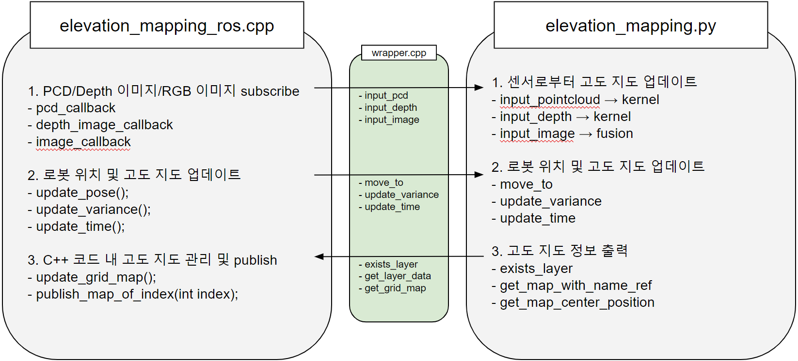
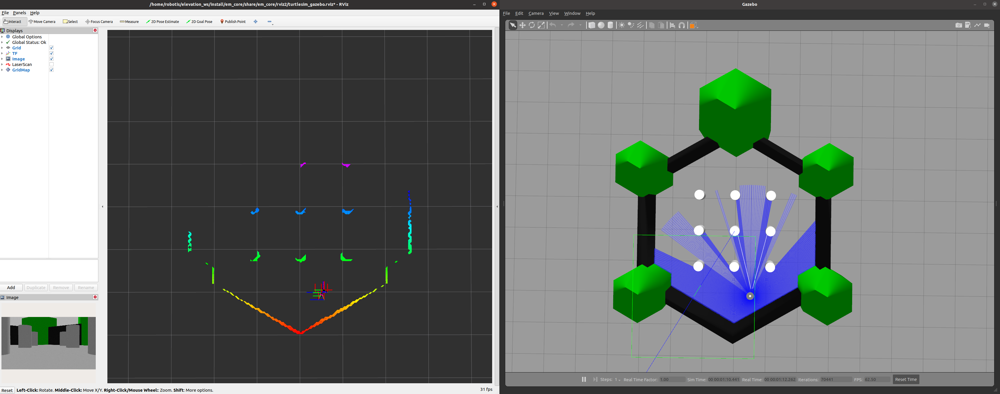
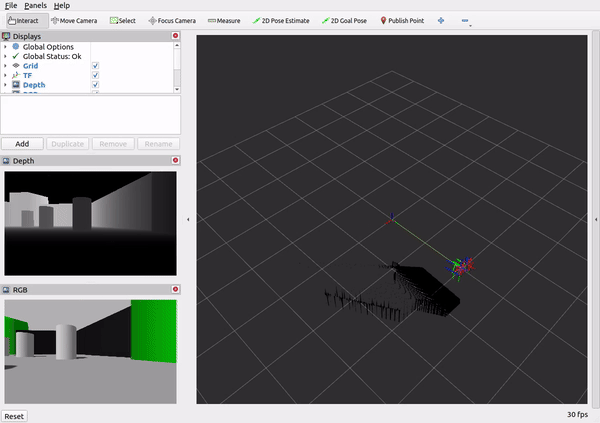
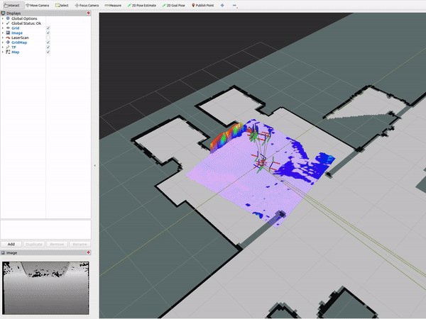
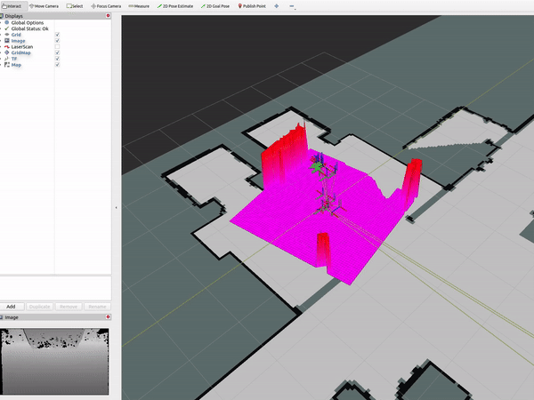

cupy가 동작하지 않음. 다른 레포지토리 참고하여 수정 필요

# 2.5D 고도 지도

## 1. 개요

GPU를 활용하여 2.5D 고도 지도를 제작하는 파이프라인 ([기존 레퍼지토리](https://github.com/leggedrobotics/elevation_mapping_cupy))
- elevation_mapping_ros.cpp: ROS 연결 및 주기적 지도 관리
- elevation_mapping.py: cupy를 활용한 GPU 기반 고도 지도 관리



## 2. 설치 방법

환경 정보: Jetson AGX Orin, Ubuntu 20.04, ROS Foxy 환경에서 테스트하였다.

필요 패키지: grid_map_msgs, grid_map_ros, grid_map_cmake_helpers, grid_map_core, grid_map_cv, grid_map_rviz_plugin

### 2.1. 2.5D 고도 지도

먼저, colcon_ws에 레퍼지토리를 설치한다.

```bash
mkdir -p colcon_ws/src
cd colcon_ws/src
git clone https://github.com/ROBOTIS-move/gaemi0_welcome_code.git
```

python과 ROS 패키지들을 설치한다.
- 본 패키지는 GPU가 있는 PC에서만 사용 가능하다. Jetson AGX Orin을 사용하지 않는다면, [문서](https://leggedrobotics.github.io/elevation_mapping_cupy/getting_started/installation.html)를 참고하여 적합한 cupy 버전을 설치한다.
- Build만 하고 싶다면 install.sh 대신 install_build.sh를 실행한다. Build에 필요한 ROS 패키지만 설치한다.

```bash
cd .. # cd /path/to/colcon_ws
source src/gaemi0_welcome_code/elevation_mapping/install.sh
# source src/gaemi0_welcome_code/elevation_mapping/install_build.sh
```

필요한 패키지들을 build하고 source한다.

```bash
colcon build --packages-select em_core em_interface grid_map_msgs grid_map_ros grid_map_cmake_helpers grid_map_core grid_map_cv grid_map_rviz_plugin
source install/setup.bash
```

### 2.2. 터틀봇

### 2.2.1. Gazebo

3.1.1과 같이, 터틀봇 Gazebo 시뮬레이션으로 2.5D 고도 지도를 테스트하려면 아래 패키지들을 설치한다.

```bash
sudo apt install ros-foxy-turtlebot3-gazebo ros-foxy-turtlebot3-teleop ros-foxy-pointcloud-to-laserscan
```

### 2.2.2. ROSbag

3.1.2와 같이, 터틀봇 ROSbag로 2.5D 고도 지도를 테스트하려면 [rosbag 파일](https://drive.google.com/file/d/1NLHB5EB0XXPTyCYTimSnwEarjYnn4VVj/view?usp=sharing)을 아래 경로에 설치하고 압축 해제한다.

```bash
cd src/gaemi0_welcome_code/elevation_mapping/em_core/rosbag # cd /path/to/em_core/rosbag
unzip turtlesim_rosbag.zip
```

### 2.3. 개미 로봇

3.2와 같이, 개미 로봇 ROSbag로 2.5D 고도 지도를 테스트하려면 [rosbag 파일](https://drive.google.com/file/d/1l13TbYCkqvfNl63yxq-AIUa_oiGvG1YD/view?usp=sharing)을 아래 경로에 설치하고 압축 해제한다.

```bash
cd src/gaemi0_welcome_code/elevation_mapping/em_core/rosbag # cd /path/to/em_core/rosbag
unzip gaemi_rosbag.zip
```

## 3. 실행 방법

### 3.1. 터틀봇

### 3.1.1. Gazebo



```bash
ros2 launch em_core turtlesim_gazebo_example.launch.py
```

아래 노드를 실행하여 로봇을 키보드로 제어한다.

```bash
export TURTLEBOT3_MODEL=waffle
ros2 run turtlebot3_teleop teleop_keyboard
```

### 3.1.2. ROSbag



```bash
ros2 launch em_core turtlesim_rosbag_example.launch.py
```

### 3.2. 개미 로봇

### 3.2.1. 2.5D 고도 지도



```bash
ros2 launch em_core gaemi_rosbag_example.launch.py
```

### 3.2.2. 플러그인: 높이 임계값 설정



```bash
ros2 launch em_core gaemi_rosbag_height_thresh_example.launch.py
```

이 플러그인은 로봇 base_footprint 프레임 기준으로 높이가 2cm보다 높은 장애물을 표시한다.

이 [문서](https://leggedrobotics.github.io/elevation_mapping_cupy/usage/plugins.html)에서 플러그인을 추가하거나 기존 플러그인을 참고한다.
